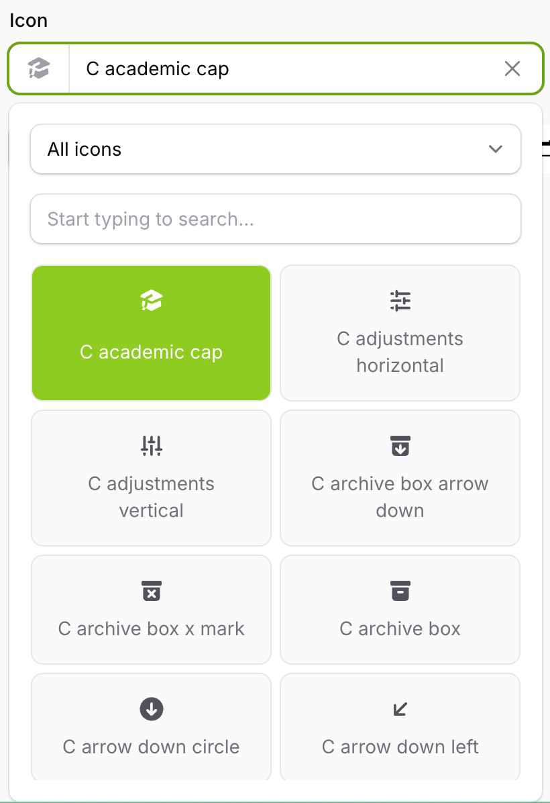
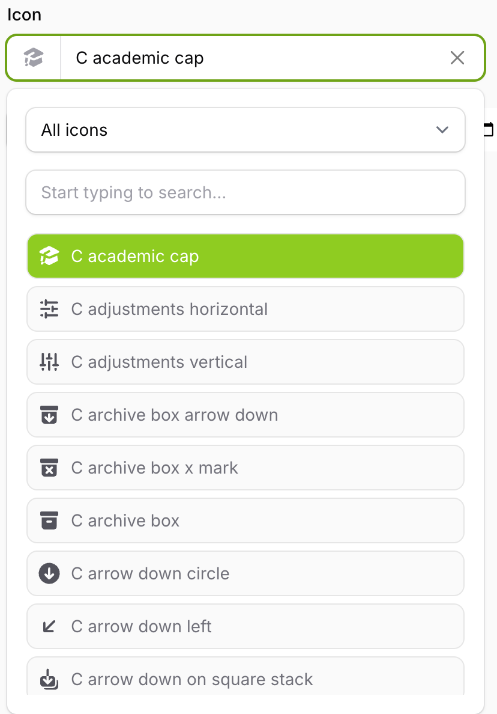
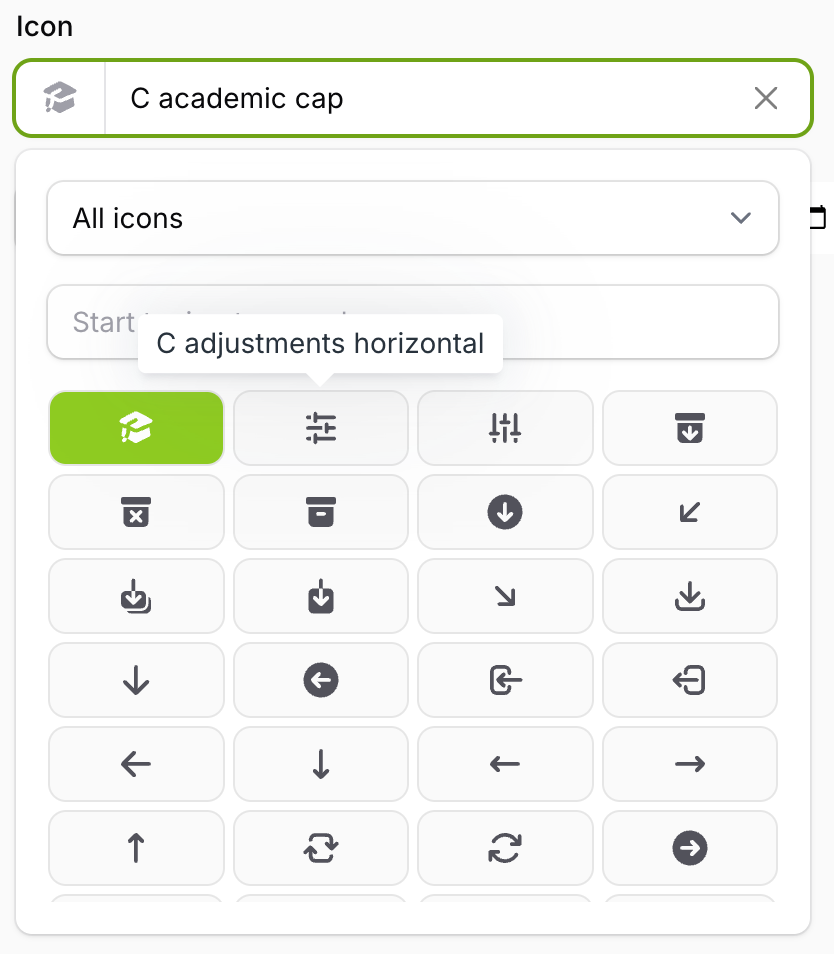

# Search result views

Out of the box we provide three different views for the search results, so you can choose the one that fits the amount of icons you offer and the space you have.

## Grid view

This is the default. Icons are shown in a grid with their name underneath.

```php
IconPicker::make('icon')
    ->gridSearchResults();
```



## List view

Icons are rendered in a list together with their name.

```php
IconPicker::make('icon')
    ->listSearchResults();
```



## Icons view

Icons are rendered in a compact grid with only the icons visible. This one fits the most icons on screen, so it's a good choice for large sets.

By default each icon has a tooltip with its name. You can turn the tooltips off if you don't want them:

```php
IconPicker::make('icon')
    ->iconsSearchResults();      // With tooltips
    
IconPicker::make('icon')
    ->iconsSearchResults(false); // Without tooltips
```



## Using your own view

If none of the three fit, you can render the results yourself. Please see [custom search results view](../advanced/02-custom-search-results-view.md).
